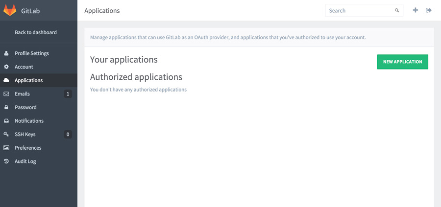
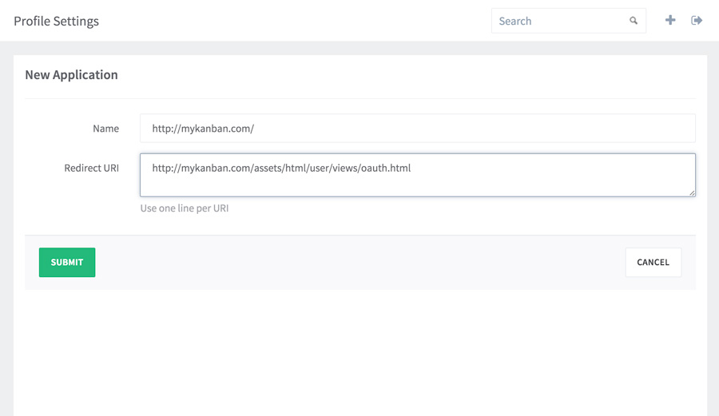

# Installation from binary

Binary distribution is available for 64 bit Linux and MacOS.

**NOTE** LeanLabs Kanban requires Redis server.

## Running the binary

1. Download

    Download the [latest binary release](http://kanban.leanlabs.io/downloads).

2. Install Redis

    Official [Redis server documentation](http://redis.io/download#installation).

    Or you could do it like this for Ubuntu:

    ```bash
    apt-get install redis-server
    service redis-server start
    ```

    **NOTE** For now LeanLabs Kanban can access Redis only via port, e.g. "127.0.0.1:6379".

3. Setup application for OAuth in GitLab.

    Go to your GitLab profile section "Application" and press button "New Application"

    

    After this you will see "New application" form, where "Name" is arbitrary name, e.g. "kanban", and "Redirect URI" is an URL in kanban where users will be sent after authorization in GitLab.

    
    
    **IMPORTANT** The "Redirect URI" is composed of 2 parts: the hostname of you kanban installation, and the fixed path part, referring to actual route to redirect. 

    The path part always the same -  "/assets/html/user/views/oauth.html", the hostname part strongly depends on kanban "--server-hostname" option, the hostname of redirect uri and option must be the same, including protocol and port information. 

    **IMPORTANT** Redirect URL must include port if not 80 or 443. 

    Here are some examples of composing redirect uri:

    --server-hostname="http://mykanban.com", then the "Redirect URI" must be "http://mykanban.com/assets/html/user/views/oauth.html"

    --server-hostname="http://mykanban.com:9000", then "Redirect URI" must be "http://mykanban.com:9000/assets/html/user/views/oauth.html"

    For now we does not support setting up kanban in GitLab "subdirectory", e.g. you can not setup kanban to be accessed via "http://mygitlab.com/kanban", this is planned in future releases.

4. Start LeanLabs Kanban application

    Now you could start kanban, do not forget to provide GitLab OAuth client ID and client secret to kanban.

    ```bash
    kanban server
        --server-listen="0.0.0.0:80"
        --server-hostname="http://mykanban.com"
        --gitlab-url="https://gitlab.com"
        --gitlab-client="Application ID"
        --gitlab-secret="Application secret"
        --redis-addr="127.0.0.1:6379"
    ```

    That is it. Now you should be able to access board on "http://mykanban.com" and login via GitLab OAuth.

## Available configuration options

**NOTE** The variables that are not explicitly set will take the default values.

**NOTE** You could configure LeanLabs Kanban via command line options, or via environment variables.

Here are the list of available command line option and mirroring env variables:

- **--server-listen** (env **KANBAN_SERVER_LISTEN**) - default to "0.0.0.0:80", IP:PORT (e.g. 0.0.0.0:80) which kanban will listen for incoming requests.

- **--server-hostname** (env **KANBAN_SERVER_HOSTNAME**) - default to "http://localhost", URL on which LeanLabs Kanban will be reachable (e.g. http://mykanban.com). The hostname must be composed of the protocol part ("http://" or "https://"), the domain or ip (e.g. mykanban.com or 192.168.0.100) and the port, if not 80 or 443 (e.g. ":9000"). For example, if board will be reachable on domain "mykanban.com" and port 9000 the resulting value must be "http://mykanban.com:9000".

- **--security-secret** (env **KANBAN_SECURITY_SECRET**) - default to "qwerty", this string is used to generate user auth tokens. Kanban uses json web tokens to identify users, this string is used to encrypt those tokens. You must change it to something more random then "qwerty" if you installation could be exposed to the whole internet.

- **--gitlab-url** (env **KANBAN_GITLAB_URL**) - default to "https://gitlab.com", your GitLab host URL, if you use self hosted GitLab installation the value must also include the protocol, domain or ip and the port if not 80 or 443. 

    **WARNING** The kanban board should be able to resolve GitLab installation domain. If you GitLab installation domain could not be resolved, then you must explicitly define the GitLab server IP, e.g. via hosts file or dnsmasq.

- **--gitlab-client** (env **KANBAN_GITLAB_CLIENT**) - default to "qwerty", your GitLab OAuth client id

- **--gitlab-secret** (env **KANBAN_GITLAB_SECRET**) - default to "qwerty", your GitLab OAuth client secret key

- **--redis-addr** (env **KANBAN_REDIS_ADDR**) - default to "127.0.0.1:6379", Redis server address - IP:PORT. LeanLabs Kanban requires redis server to function properly, it stores users identities there.

- **--redis-password** (env **KANBAN_REDIS_PASSWORD**) - default to "" (empty string), Redis server password if any.

- **--redis-db** (env ** KANBAN_REDIS_DB**) - default to "0", redis server database numeric index, from 0 to 16, also rarely required to be changed if ever.

You could list available options with "--help" subcommand:

```bash
kanban server --help
```

## Setting up behind proxy.

LeanLabs Kanban board processes http requests directly, but sometimes you want to set it behind proxy, e.g. if you want https you definitely should use proxy, because for now kanban does not able to handle https traffic directly.

Proxy configuration, including supported configuration files also [described in our docs](/docs/configuration/).
